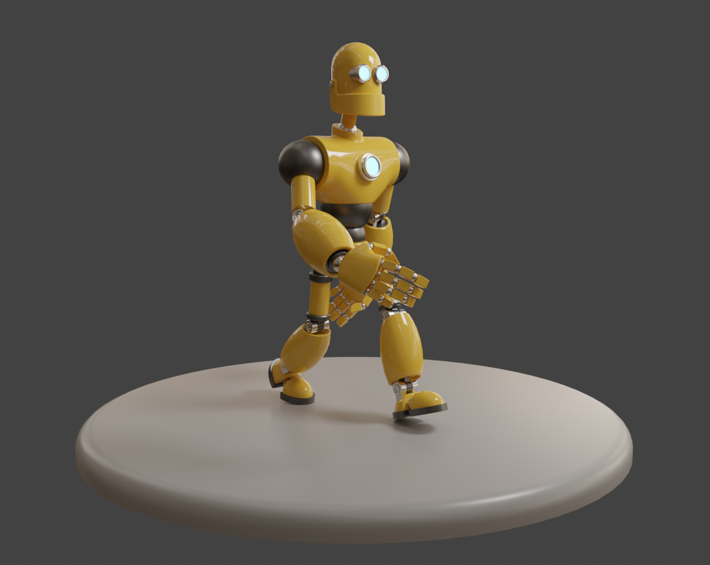

# This is a [Blender](https://www.blender.org/) project.




## Getting Started

First, clone this repository:

```bash
https://github.com/felipealbuq/BelchiorRobot.git
```

Open the file BelchiorRobot.blend and see the result. In this project, textures, shading and animations were worked on.


## Animation Video from Blender Renderer

Below, you can see the animation video made with images from the VideoFrames folder.

https://github.com/felipealbuq/BelchiorRobot/assets/60708056/275df2f5-f7a7-416a-9c93-c351b75f11e5


## Learn More

To learn more about Blender, take a look at the following resources:

- [Blender Documentation](https://docs.blender.org/) - learn about Blender.

- [Blender Studio](https://studio.blender.org/welcome/) - Blender tutorials.


